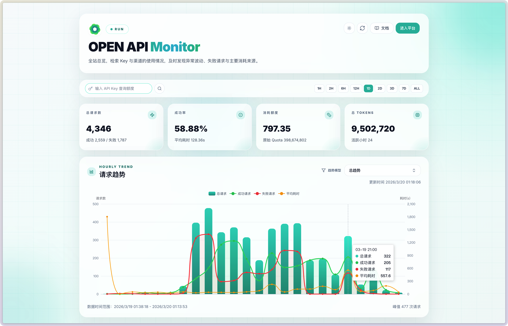
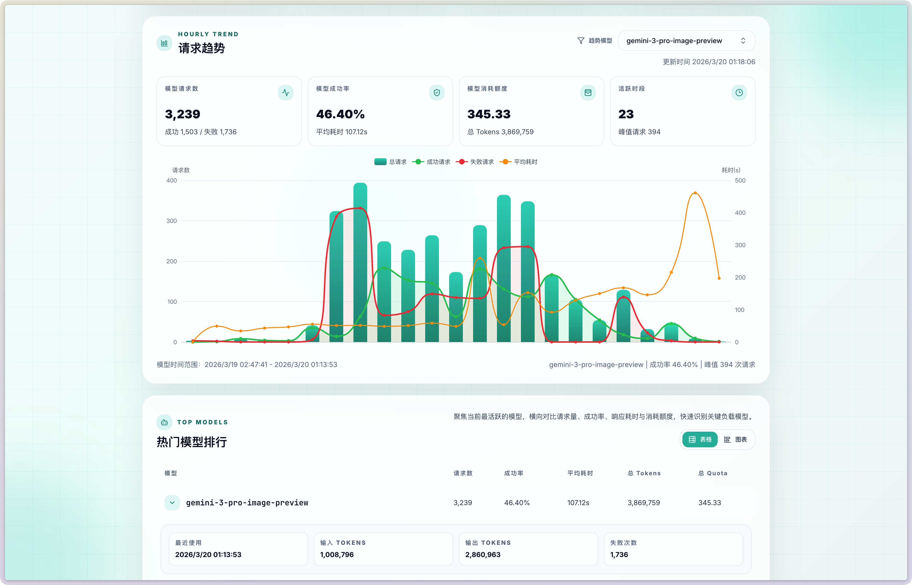
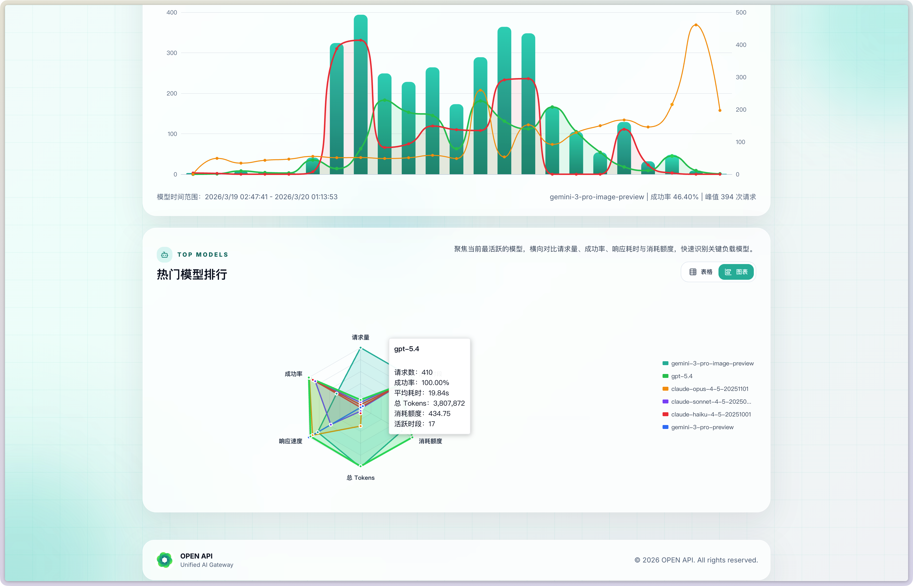
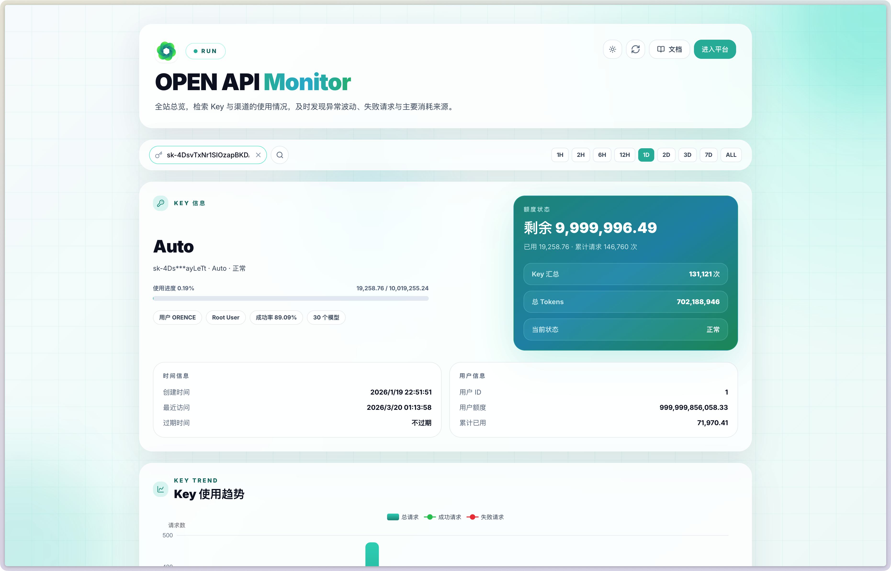
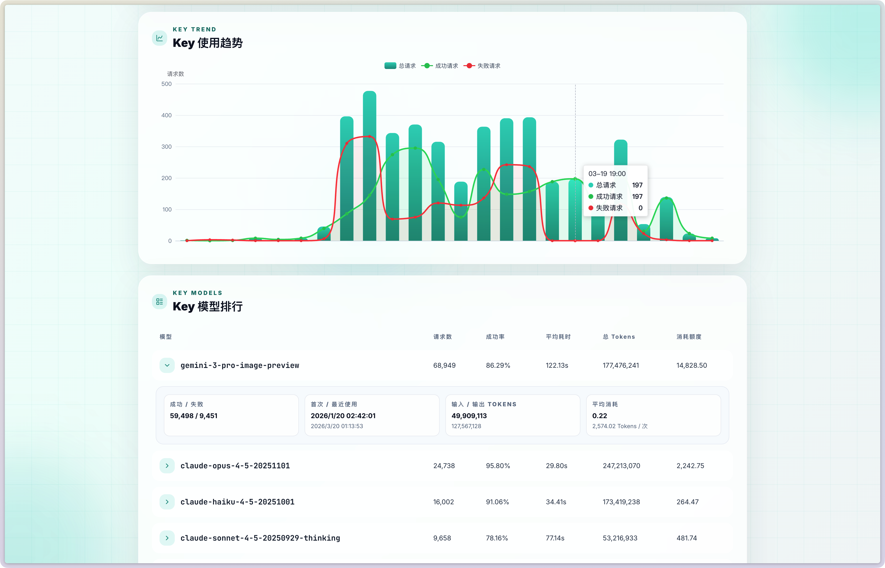
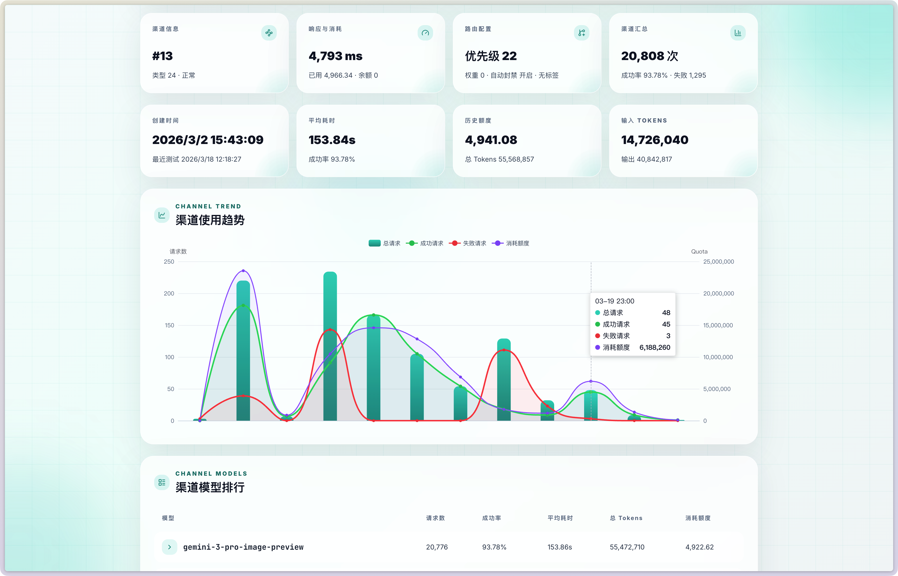
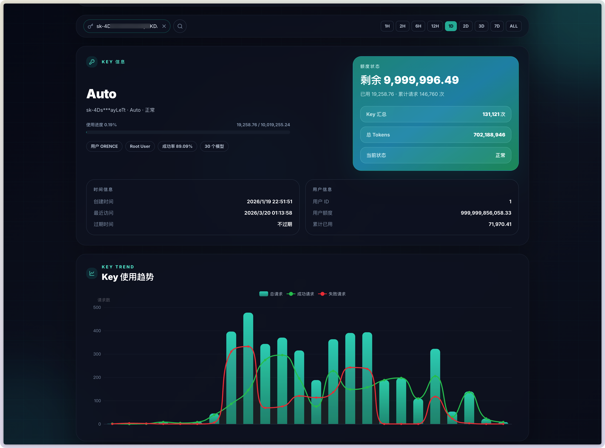
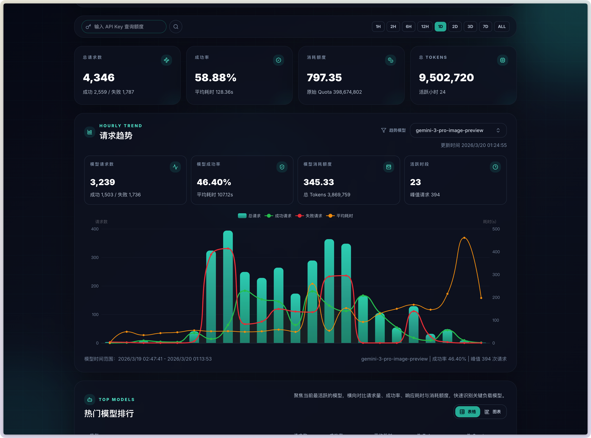

# NewAPI Monitor Service

`newapi-monitor-service` 是一个独立的 Node.js 监控服务，用于读取 `new-api` 的 PostgreSQL 日志库，并提供总览、模型、Key、渠道等统计接口，同时内置一套可直接使用的仪表盘页面。

## 页面截图

<table>
  <tr>
    <td></td>
    <td></td>
  </tr>
  <tr>
    <td></td>
    <td></td>
  </tr>
  <tr>
    <td></td>
    <td></td>
  </tr>
  <tr>
    <td></td>
    <td></td>
  </tr>
</table>

## 功能概览

- 直连 `new-api` PostgreSQL 日志库
- 提供全站总览、趋势图、热门模型排行
- 支持按 `Key` 和 `渠道 ID` 查询详细统计
- 提供独立前端仪表盘页面
- 支持 `MONITOR_API_TOKEN` 鉴权
- 支持极验 4 代验证保护搜索行为
- 进程内内存缓存
- 数据库连接异常轻量自动重试
- 支持 `PM2` 部署

## 技术栈

- Node.js
- TypeScript
- Express
- PostgreSQL (`pg`)
- Zod
- 前端静态页面：Tailwind CSS + ECharts + Lucide

## 目录说明

- `src/`：服务端源码
- `public/dashboard.html`：仪表盘前端页面
- `.env.example`：环境变量模板
- `ecosystem.config.cjs`：PM2 配置文件

## 快速开始

### 1. 复制环境变量

```bash
cp .env.example .env
```

### 2. 填写数据库配置

至少需要配置以下环境变量：

- `NEWAPI_DB_HOST`
- `NEWAPI_DB_PORT`
- `NEWAPI_DB_USER`
- `NEWAPI_DB_PASSWORD`
- `NEWAPI_DB_NAME`

### 3. 安装依赖

```bash
pnpm install
```

### 4. 开发模式运行

```bash
pnpm dev
```

### 5. 构建并启动

```bash
pnpm build
pnpm start
```

### 6. 类型检查

```bash
pnpm check
```

## 环境变量

### 服务基础配置

| 变量名 | 默认值 | 说明 |
| --- | --- | --- |
| `PORT` | `43100` | 服务监听端口 |
| `MONITOR_BASE_PATH` | 空 | 仪表盘与 API 的基础路径，例如 `/monitor` |
| `API_PREFIX` | `/api` | API 路径前缀 |
| `CORS_ORIGIN` | `*` | CORS 来源 |
| `CACHE_TTL_SECONDS` | `900` | 内存缓存时间，单位秒 |
| `NEWAPI_URL` | - | 上游 `new-api` 地址，用于读取站点配置 |

### 鉴权与搜索验证

| 变量名 | 必填 | 说明 |
| --- | --- | --- |
| `MONITOR_API_TOKEN` | 否 | API 鉴权令牌；也可通过 `monitor_api_token` 查询参数传入前端页面 |
| `GEETEST_CAPTCHA_ID` | 否 | 极验 4 代验证 ID |
| `GEETEST_CAPTCHA_KEY` | 否 | 极验 4 代验证 Key |

### 数据库配置

| 变量名 | 必填 | 说明 |
| --- | --- | --- |
| `NEWAPI_DB_HOST` | 是 | PostgreSQL 主机 |
| `NEWAPI_DB_PORT` | 是 | PostgreSQL 端口 |
| `NEWAPI_DB_USER` | 是 | PostgreSQL 用户名 |
| `NEWAPI_DB_PASSWORD` | 是 | PostgreSQL 密码 |
| `NEWAPI_DB_NAME` | 是 | PostgreSQL 数据库名 |
| `NEWAPI_DB_SSL` | 否 | 是否启用 SSL，`true` / `false` |

## 运行与部署

### 直接运行

```bash
pnpm build
pnpm start
```

### 使用 PM2

项目已内置 `ecosystem.config.cjs`，并且已将 `pm2` 加入项目依赖。默认使用构建后的 `dist/index.js` 和项目根目录下的 `.env`。

启动：

```bash
pnpm build
pnpm run pm2:start
```

常用命令：

```bash
pnpm run pm2:status
pnpm run pm2:logs
pnpm run pm2:restart
pnpm run pm2:stop
```

### NEWAPI 部署示例

`new-api` 的 Docker Compose 示例已拆分到单独文档：

- `NEWAPI_DEPLOYMENT_EXAMPLE.md`

### 挂载到 new-api 的 `/monitor` 子路径

如果你已经有一个正在运行的 `new-api` 站点，例如：

- `new-api` 对外访问地址：`https://example.com`
- `new-api` 本地反代端口：`127.0.0.1:3000`
- `newapi-monitor-service` 本地监听端口：`127.0.0.1:4024`

那么可以把监控面板直接挂到主站的 `/monitor` 子路径下。

#### 1. 监控服务环境变量

`newapi-monitor-service` 的 `.env` 至少需要包含：

```env
PORT=4024
MONITOR_BASE_PATH=/monitor
API_PREFIX=/api

NEWAPI_DB_HOST=127.0.0.1
NEWAPI_DB_PORT=15432
NEWAPI_DB_USER=YOUR_DB_USER
NEWAPI_DB_PASSWORD=YOUR_DB_PASSWORD
NEWAPI_DB_NAME=new-api
NEWAPI_DB_SSL=false

NEWAPI_URL=http://127.0.0.1:3000
```

说明：

- `PORT=4024`：监控服务自身监听端口
- `MONITOR_BASE_PATH=/monitor`：告诉服务它现在不是部署在根路径，而是部署在 `/monitor`
- `NEWAPI_URL=http://127.0.0.1:3000`：用于读取上游 `new-api` 的站点信息
- 如果数据库是通过 Docker 映射到宿主机 `15432`，则数据库连接写宿主机地址和映射端口即可

#### 2. Nginx / 宝塔反向代理示例

核心思路：

- `/monitor` 与 `/monitor/` 转发到监控服务 `4024`
- 其余根路径 `/` 继续交给原本的 `new-api` 服务 `3000`

```nginx
#PROXY-START/
location = /monitor {
    return 301 /monitor/;
}

location ^~ /monitor/ {
    proxy_pass http://127.0.0.1:4024;
    proxy_http_version 1.1;

    proxy_set_header Host $host;
    proxy_set_header X-Real-IP $remote_addr;
    proxy_set_header X-Forwarded-For $proxy_add_x_forwarded_for;
    proxy_set_header X-Forwarded-Proto $scheme;
    proxy_set_header X-Forwarded-Host $host;
    proxy_set_header X-Forwarded-Port $server_port;
    proxy_set_header X-Original-URI $request_uri;
    proxy_set_header X-Original-Method $request_method;

    proxy_set_header Upgrade $http_upgrade;
    proxy_set_header Connection "upgrade";

    proxy_connect_timeout 3600s;
    proxy_read_timeout 3600s;
    proxy_send_timeout 3600s;

    proxy_buffering off;
    proxy_request_buffering off;
}

location ^~ / {
    proxy_pass http://127.0.0.1:3000;

    # 核心代理头设置
    proxy_set_header Host $host;
    proxy_set_header X-Real-IP $remote_addr;
    proxy_set_header X-Forwarded-For $proxy_add_x_forwarded_for;
    proxy_set_header X-Forwarded-Proto $scheme;
    proxy_http_version 1.1;
    
    # ⭐ 客户端IP传递 - 核心配置
    proxy_set_header X-Forwarded-Proto $scheme;
    proxy_set_header X-Forwarded-Host $host;
    proxy_set_header X-Forwarded-Port $server_port;
    proxy_set_header X-Original-URI $request_uri;
    proxy_set_header X-Original-Method $request_method;

    # WebSocket支持
    proxy_set_header Upgrade $http_upgrade;
    proxy_set_header Connection "upgrade";
    
    # 禁用WebSocket连接的压缩
    gzip off;
    proxy_set_header Accept-Encoding "";
    
    # 强制不缓存 API 响应
    expires -1;
    add_header Cache-Control "no-cache, no-store, must-revalidate";
    add_header Pragma "no-cache";

    # 超时控制（API 建议配置）
    proxy_connect_timeout 3600s;    # 后端连接超时
    proxy_read_timeout 3600s;      # 读取响应超时（根据业务调整）
    proxy_send_timeout 3600s;      # 发送请求超时

    # 长连接优化（适用于高频 API）
    proxy_headers_hash_max_size 512;
    proxy_headers_hash_bucket_size 128;
    keepalive_timeout 360s;
    keepalive_requests 1000;

    # 关闭代理缓冲（适用于流式 API 或大响应）
    proxy_buffering off;
    proxy_request_buffering off;

    # 安全增强（可选）
    proxy_hide_header X-Powered-By;  # 隐藏后端框架信息
    add_header X-Content-Type-Options "nosniff";
    add_header X-Frame-Options "DENY";
    add_header X-XSS-Protection "1; mode=block";
}
#PROXY-END/
```

说明：

- `location = /monitor` 用于把不带斜杠的地址跳转到 `/monitor/`
- `location ^~ /monitor/` 必须写在根路径代理前面，否则可能被主站 `/` 抢走
- 不要再对 `/monitor` 做额外 `rewrite`，否则会破坏监控服务的子路径识别

#### 3. 最终访问路径

完成配置后：

- 主站入口：`https://example.com/`
- 监控入口：`https://example.com/monitor/`
- 监控 API：`https://example.com/monitor/api/*`

#### 4. 与 new-api 共用站点信息

当监控服务挂在 `new-api` 站点下时，前端会优先尝试从浏览器 `localStorage` 读取以下信息：

- `docs_link`
- `system_name`
- `logo`
- `theme`
- `theme-mode`

其中：

- `进入平台` 按钮会直接跳转到当前站点根路径下的 `/console`
- `theme-mode` 支持 `light`、`dark`、`auto`
- 当 `theme-mode=auto` 时，监控页面会跟随系统深浅色变化
- 同时也会兼容主站写入的 `theme` 值，实现与 `new-api` 页面主题无缝切换

## 前端仪表盘

默认情况下，服务启动后访问根路径即可打开仪表盘：

- `/`

如果设置了 `MONITOR_BASE_PATH=/monitor`，则：

- 仪表盘入口为 `/monitor`
- 静态资源路径为 `/monitor/static/*`
- API 路径为 `/monitor/api/*`

仪表盘支持：

- 全站总览
- 小时级趋势图
- 热门模型排行
- `Key` 查询
- 渠道查询

## 搜索规则

仪表盘左上角搜索框默认用于查询 Key / 渠道：

- 输入以 `sk-` 开头的内容：按 API Key 查询
- 输入纯数字：按渠道 ID 查询

## 搜索验证

如果配置了 `GEETEST_CAPTCHA_ID` 和 `GEETEST_CAPTCHA_KEY`，则 Key / 渠道搜索需要先通过极验验证。

验证规则：

- 同一个搜索对象验证一次后，可继续切换时间范围、刷新、自动刷新
- 更换搜索对象后，必须重新验证
- 页面载入时会清掉上一次会话残留的搜索验证
- 页面关闭时会主动撤销当前搜索验证
- 如果传入有效的 `MONITOR_API_TOKEN`，则可跳过极验验证

后端使用的极验二次校验接口：

- `https://gcaptcha4.geetest.com/validate`

## 鉴权

如果设置了 `MONITOR_API_TOKEN`，则 API 路径默认需要带上以下任一种凭证：

- `Authorization: Bearer <token>`
- `x-api-key: <token>`

前端页面也支持通过 URL 查询参数传入：

- `?monitor_api_token=<token>`

说明：

- `dashboard`、`logs`、`logs/models` 等普通接口受 `MONITOR_API_TOKEN` 保护
- `key/quota` 与 `channel/records` 额外支持“极验验证或 token 放行”
- 如果配置了 `MONITOR_BASE_PATH=/monitor`，则上述接口实际路径会变为 `/monitor/api/*`

## API 一览

### 健康检查

- `GET /api/health`

### 站点配置

- `GET /api/config`

返回前端页面需要的站点配置、额度单位、极验开关等信息。

### 总览

- `GET /api/dashboard?hours=24`
- `GET /api/dashboard?hours=all`

返回：

- `overview`
- `hourly_stats`
- `top_models`

### 模型排行

- `GET /api/logs/models?hours=24`
- `GET /api/logs/models?hours=all`

返回当前时间范围内的模型汇总数据。

### 单模型明细

- `GET /api/logs?model_name=xxx&hours=24`
- `GET /api/logs?model_name=xxx&hours=72`
- `GET /api/logs?model_name=xxx&hours=all`

返回：

- 模型小时趋势
- 模型汇总
- 相关渠道列表

### 渠道查询

- `GET /api/channel/records?channel_id=13`
- `GET /api/channel/records?channel_id=13&hours=24`
- `GET /api/channel/records?channel_id=13&hours=all`

返回：

- `channel`
- `usage_summary`
- `hourly_stats`
- `top_models`

### Key 查询

- `GET /api/key/quota?key=YOUR_KEY`
- `GET /api/key/quota?key=YOUR_KEY&hours=24`
- `GET /api/key/quota?key=YOUR_KEY&hours=all`

返回：

- `token`
- `user`
- `usage_summary`
- `hourly_stats`
- `user_usage_summary`
- `user_hourly_stats`
- `top_models`

### 撤销搜索验证

- `POST /api/search/access/revoke`

请求体：

```json
{
  "search_token": "your_search_token"
}
```

用于前端页面关闭时撤销当前搜索验证凭证。

## 查询参数说明

### `hours`

- 不传：默认 `24`
- 传数字：表示最近 N 小时
- 传 `all`：表示全历史

### 默认过滤规则

服务默认会排除测试数据：

- `token_name IN ('TEST', '模型测试')`
- `content = '模型测试'`

## 缓存策略

- 使用进程内内存缓存
- 缓存会在服务重启后清空
- 缓存时间由 `CACHE_TTL_SECONDS` 控制

## 数据库说明

- 使用 `pg.Pool` 管理连接
- 会话默认尝试设置为只读，避免误写目标日志库
- 对连接类、超时类瞬时错误提供轻量自动重试
- 当前重试策略为最多 2 次，短暂退避后重试

## 错误处理

服务统一返回常见错误响应：

- `400 Invalid query parameters`
- `401 Unauthorized`
- `403 Search verification required / invalid`
- `404 Key not found / Channel not found`
- `500 Internal server error`

## 适用场景

适合以下场景：

- 独立部署一个只读监控面板
- 从 `new-api` 主项目中拆出监控能力
- 给运营或管理员提供轻量查询页面
- 通过 `PM2` 或其他进程管理器长期运行

## 说明

- 本项目默认面向只读监控场景，不处理写入业务
- 仪表盘搜索验证依赖极验前端脚本和服务端二次校验
- 如果未配置 `NEWAPI_URL`，服务仍可运行，但 `/api/config` 返回的站点配置会受限
